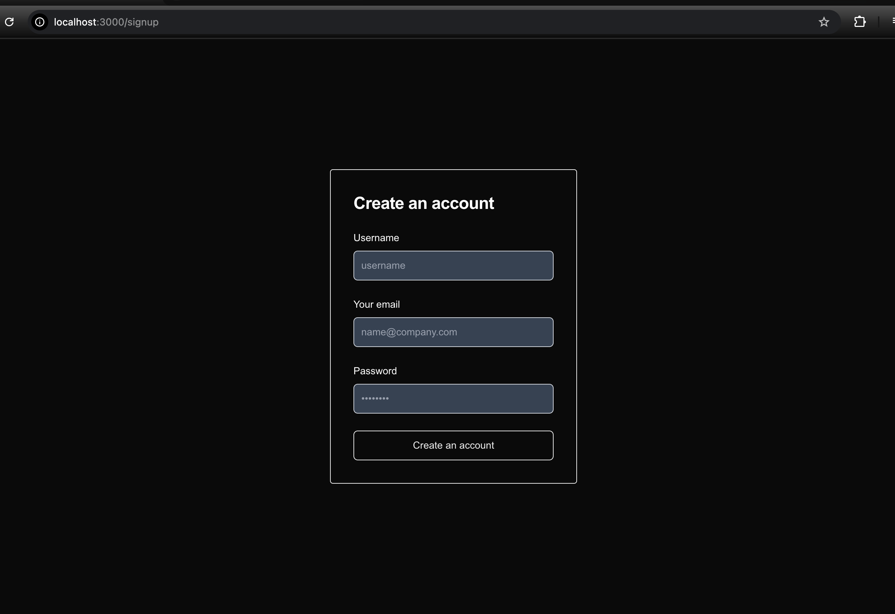
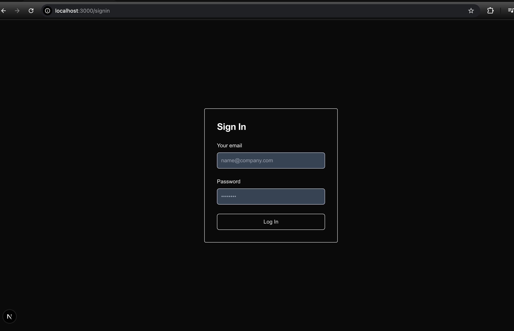

## Getting Started

First, run the development server:

```bash
npm run dev
```
### URL referent
- [authjs.dev](https://authjs.dev/getting-started/migrating-to-v5)
- [prisma.io](https://www.prisma.io/)

### Readdatabase
Prisma Studio (GUI Tool)
```bash
npx prisma studio
```
នេះនឹងបើក browser window (ជាធម្មតានៅ http://localhost:5555) ដែលបង្ហាញចំណុចប្រទាក់របស់ Prisma Studio

### bcrypt using:
``` bash
npm install bcrypt

npm install --save-dev @types/bcrypt
```
### ENVIROMENT VARAIBLE
.env
```
DATABASE_URL="file:./dev.db"
```
### JWT
```bash
npm install jsonwebtoken
npm install --save-dev @types/jsonwebtoken
```
[djecrety](https://djecrety.ir/)

### app demo

