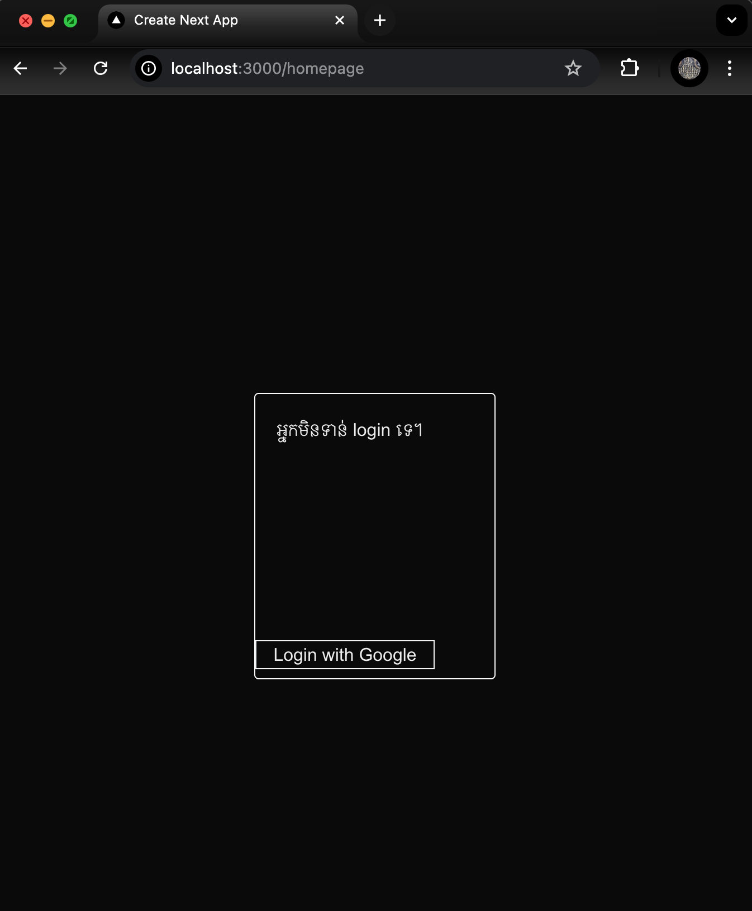

## Auth with google
ធ្វើជាមួយ Authentication (ចូល)  Authorization (អនុញ្ញាត) google

## Getting Started

First, run the development server:

```bash
npm run dev
```

Open [http://localhost:3000](http://localhost:3000) with your browser to see the result.


## Learn More
To learn more with me about Next.js 
- [Github repo](https://github.com/Dulkh91/next_js_study_demo) - I upload demo project study at here.


## .env.local
GOOGLE_CLIENT_ID = key_client_from_google
GOOGLE_CLIENT_SECRET = key_sclient_secret_from_google
NEXTAUTH_SECRET = past here from [generate-secret](https://generate-secret.vercel.app/32)




