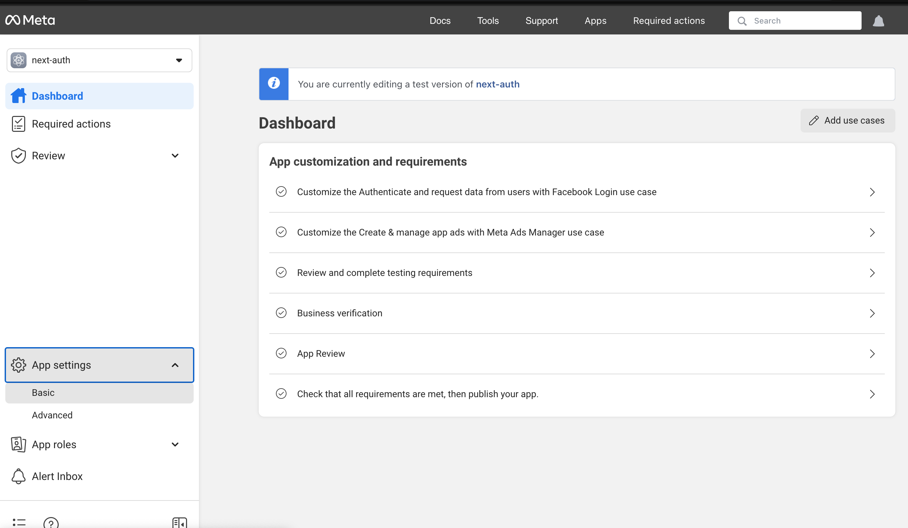

## Auth facebook
The auth facebook is a method, how to login app by facebook login.

## Start app 

First, run the development server:

```bash
npm run dev
```
### Environment Variables
.evn.local file
```
FACEBOOK_CLIENT_ID= your fb app id
FACEBOOK_CLIENT_SECRET= your fb app secret
```
## Image Demo


### URL facebook developer
[developers.facebook](https://developers.facebook.com/apps)



Permission email

confirm permission


