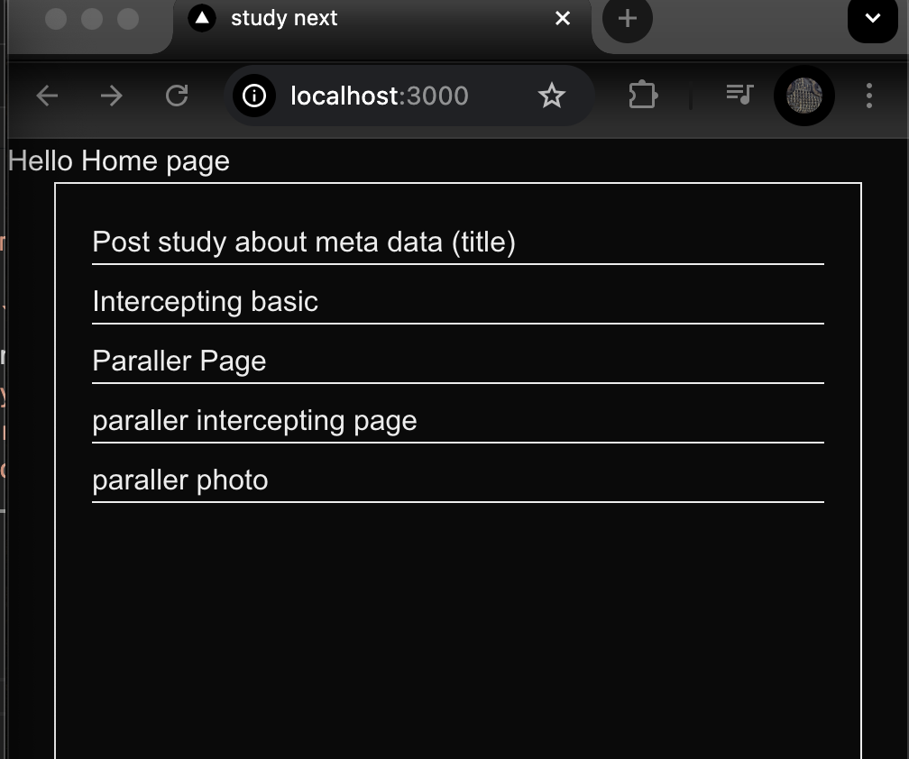
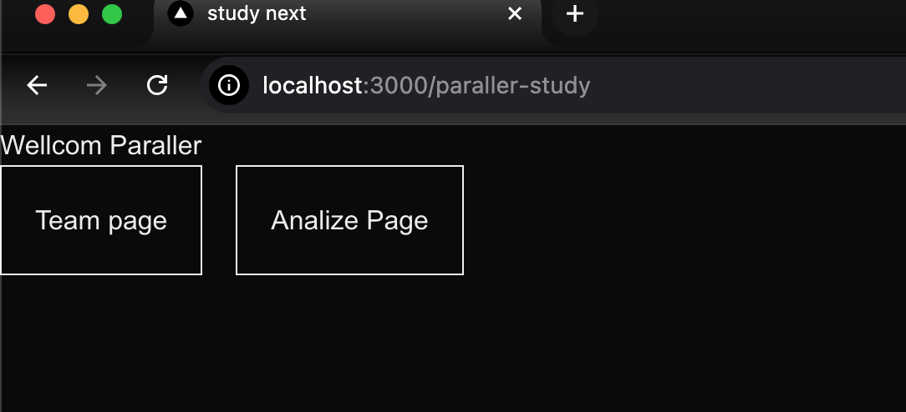
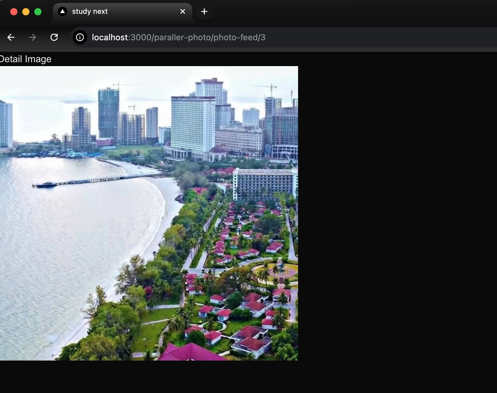

# Hompe Page 
This is a home page 


### Paraller routes
paraller routes it is the embade multi pages show on one page.



### paraller-photo/photo-feed
We study about Paraller and intercepting to make popup overlay image.
#### Image Demo





### paraller-intercepting-study
```
src/app/paraller-intercepting-study/
├── layout.tsx
├── @main/
│   └── login/
│       └── page.tsx   ← ✅ Login inside slot
```
តើហេតុអ្វីបានជា @main folder បង្កើតបញ្ហា?
នៅពេលអ្នកប្រើ Parallel Routes ដោយបង្កើត folder @main/, Next.js ចង់ឲ្យអ្នកបញ្ជាក់ថា UI ទាំងអស់នៅក្នុង segment នេះត្រូវ render តាម slot main។ បើអ្នកមិនបានបញ្ជាក់ fallback UI សម្រាប់ slot នោះ (ឧ. default.tsx) → Next.js មិនអាច resolve route ទូទៅ (ដូចជា /hello) បានទេ។

❗ បញ្ហា៖ @main បិទ UI ផ្សេងៗ
មាន @main	ត្រូវមាន @main/default.tsx ឬ @main/page.tsx
គ្មាន fallback	route /hello មិនដំណើរការ (404)
លុប @main	route /hello ដំណើរការ ✅
✅ ដំណោះស្រាយ (ដោយរក្សា @main)
បើអ្នកចង់រក្សា @main/ folder (សម្រាប់ parallel slot), ត្រូវបន្ថែម fallback UI ដូចជា៖

```tsx
// src/app/paraller-intercepting-study/@main/default.tsx
export default function DefaultMain() {
  return null // ឬ fallback UI
}
```
✅ វាជួយ Next.js render slot main ទោះបីជា route /hello មិនមាន content សម្រាប់ slot នោះ

🧪 តេស្តបន្ទាប់
បន្ថែម @main/default.tsx

Restart dev server

ចូល http://localhost:3000/paraller-intercepting-study/hello → តើ hello/page.tsx render ដែរឬទេ?

🧠 សេចក្ដីសន្និដ្ឋាន
@main គឺជា slot → ត្រូវមាន fallback (default.tsx)

បើគ្មាន fallback → route ផ្សេងៗនឹងមិនដំណើរការ

លុប @main → Next.js fallback ទៅ layout ទូទៅ → route ដំណើរការ ✅